# OpenRSVP Kubernetes Architecture - Mermaid Diagrams

This document contains all the architectural diagrams in Mermaid.js format for the OpenRSVP Kubernetes scale-out project.

---

## Table of Contents
1. [Current Architecture](#1-current-architecture-monolithic)
2. [Target Architecture (AWS)](#2-target-architecture-aws--kubernetes)
3. [Detailed Component Flow](#3-detailed-component-flow)
4. [CI/CD Deployment Pipeline](#4-cicd-deployment-pipeline)
5. [Data Migration Flow](#5-data-migration-flow)
6. [Horizontal Pod Autoscaling](#6-horizontal-pod-autoscaling-hpa)
7. [Observability Stack](#7-observability-stack)
8. [Network Architecture](#8-network-architecture-aws)
9. [Worker Job Execution](#9-worker-job-execution-patterns)

---

## 1. Current Architecture (Monolithic)

**Description**: Current single-container deployment with SQLite

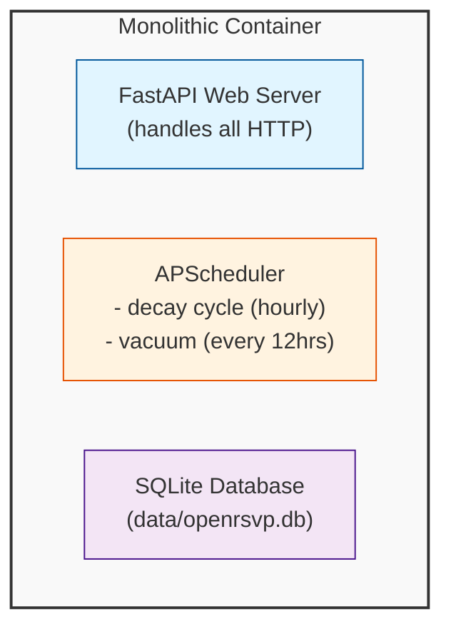

---

## 2. Target Architecture (AWS + Kubernetes)

**Description**: Multi-tier architecture with EKS, web pods, worker pods, and RDS PostgreSQL

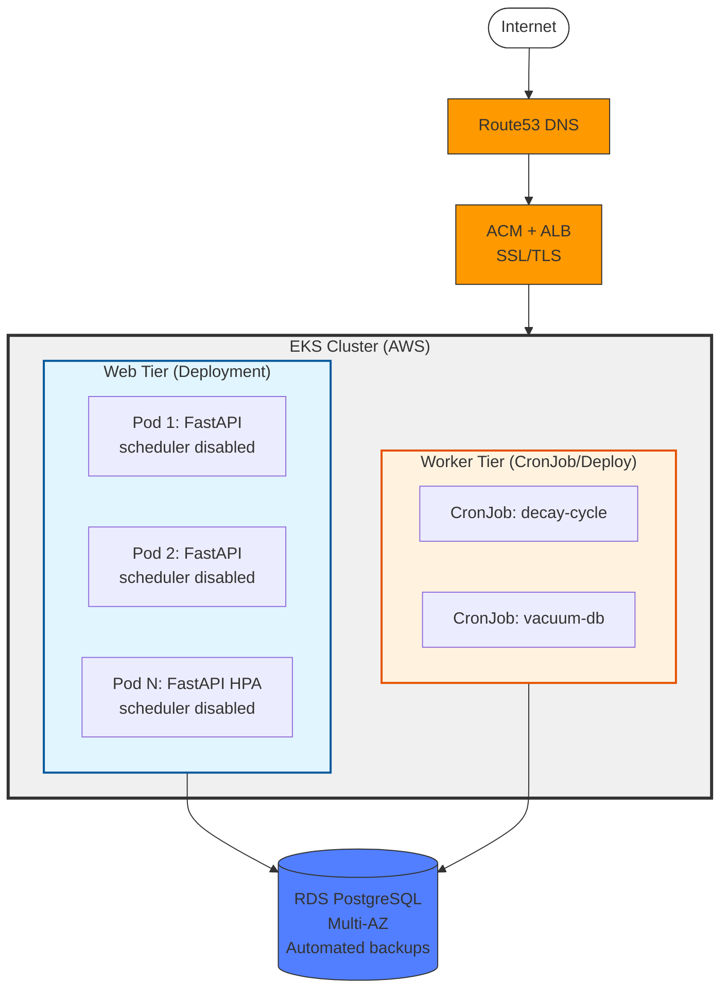

---

## 3. Detailed Component Flow

**Description**: Internal Kubernetes service mesh and database connections

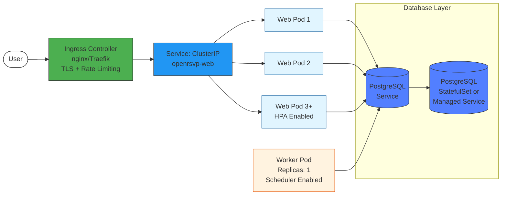

---

## 4. CI/CD Deployment Pipeline

**Description**: Automated build, test, and deployment flow

```mermaid
flowchart LR
    Dev[Developer] -->|git push| Repo[GitHub Repo]
    Repo -->|webhook| CI[CI/CD Pipeline<br/>GitHub Actions]
    
    CI --> Build[Build Docker Image]
    Build --> Test[Run Tests<br/>pytest]
    Test --> Push[Push to Registry<br/>ECR/DockerHub]
    
    Push --> Deploy{Deploy Stage}
    Deploy -->|dev| DevK8s[Dev K8s Cluster<br/>Bare Metal]
    Deploy -->|prod| ProdK8s[Prod EKS Cluster<br/>AWS]
    
    ProdK8s --> Rolling[Rolling Update<br/>Web Pods]
    ProdK8s --> CronUpdate[Update CronJobs<br/>Workers]
    
    style Dev fill:#fff,stroke:#333
    style Repo fill:#24292e,stroke:#333
    style CI fill:#2088ff,stroke:#333
    style Build fill:#ffa500,stroke:#333
    style Test fill:#4caf50,stroke:#333
    style Push fill:#00bcd4,stroke:#333
    style Deploy fill:#ff9800,stroke:#333
    style DevK8s fill:#e1f5ff,stroke:#333
    style ProdK8s fill:#ff9900,stroke:#333
```

---

## 5. Data Migration Flow

**Description**: SQLite to PostgreSQL migration process

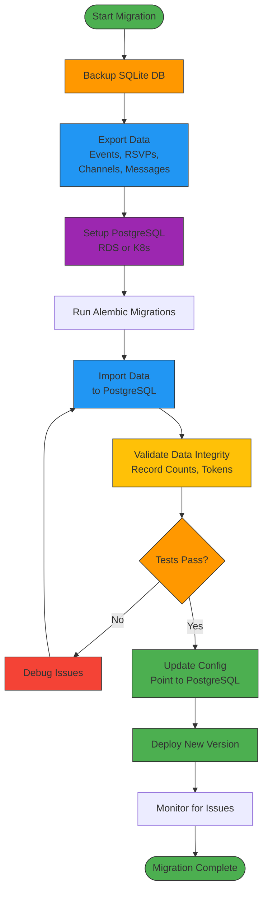

---

## 6. Horizontal Pod Autoscaling (HPA)

**Description**: How web tier scales based on CPU/memory metrics

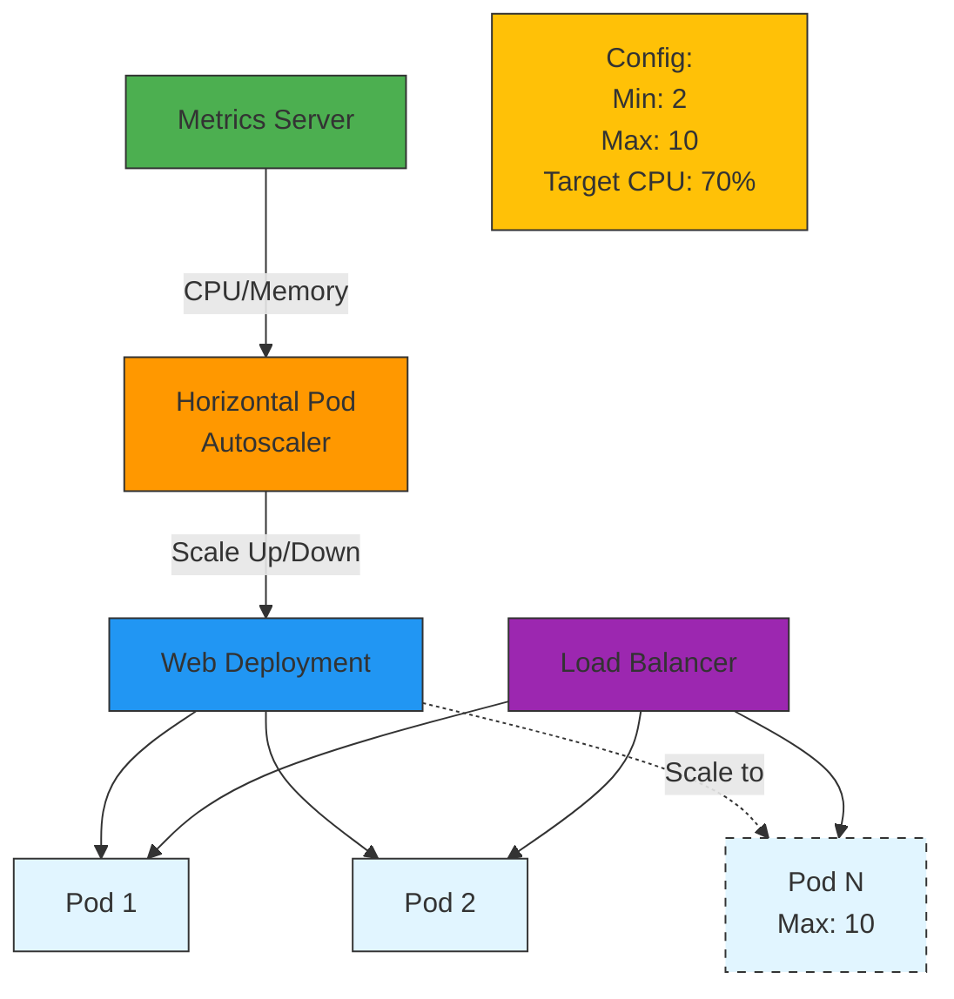

---

## 7. Observability Stack

**Description**: Monitoring, logging, and alerting infrastructure

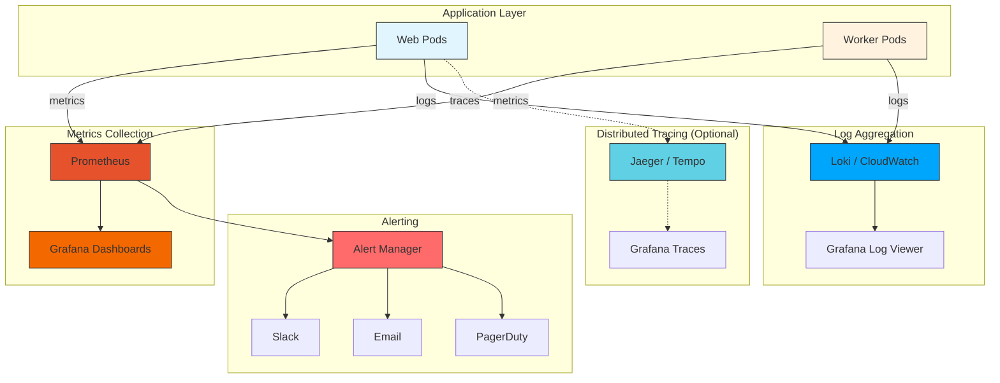

---

## 8. Network Architecture (AWS)

**Description**: VPC layout with public/private subnets and security groups

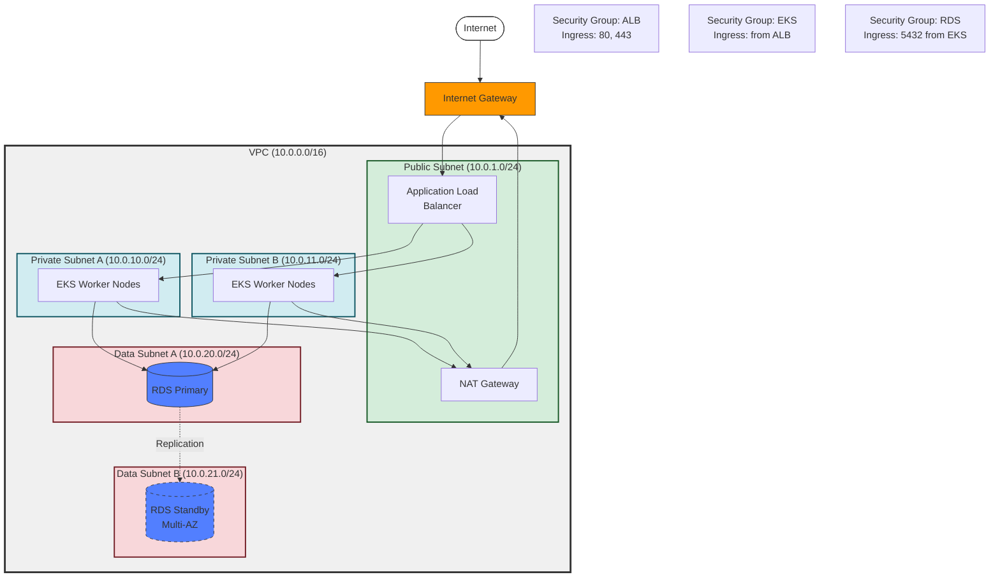

---

## 9. Worker Job Execution Patterns

**Description**: Three options for running background jobs in Kubernetes

### Option A: APScheduler in Deployment

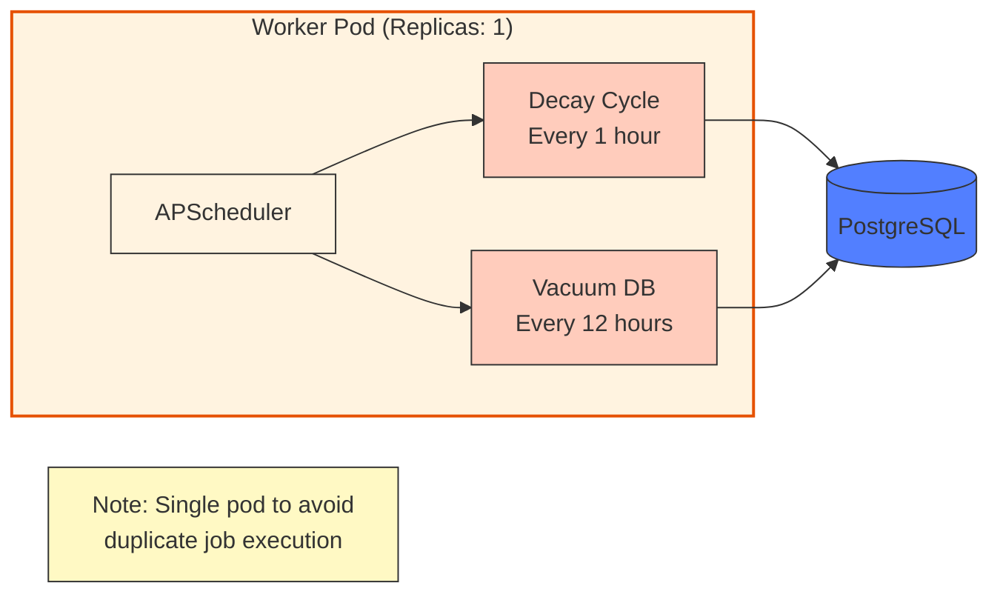

### Option B: Kubernetes CronJobs (Recommended)

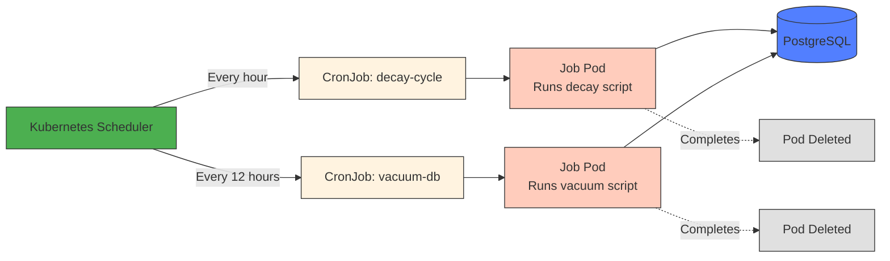

### Option C: Distributed Task Queue (Future)

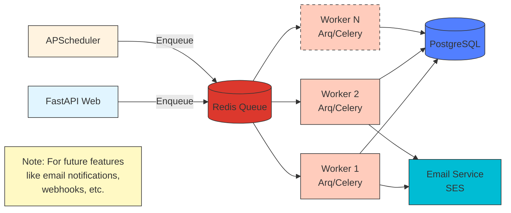

---

## Usage Notes

### Viewing Mermaid Diagrams

These diagrams will render automatically on:
- **GitHub** - in README.md or any .md file
- **GitLab** - in README.md or any .md file
- **VS Code** - with "Markdown Preview Mermaid Support" extension
- **Obsidian** - native support
- **Notion** - using mermaid code blocks

### Editing Diagrams

You can edit these diagrams using:
- **Mermaid Live Editor**: https://mermaid.live/
- **VS Code** with Mermaid extension
- Any text editor (it's just text!)

### Exporting Diagrams

To export as PNG/SVG:
1. Copy the mermaid code
2. Paste into https://mermaid.live/
3. Click "Download PNG" or "Download SVG"

---

## Diagram Legend

### Colors
- **Blue (#e1f5ff)**: Web tier / Application pods
- **Orange (#fff3e0)**: Worker tier / Background jobs
- **Purple (#527fff)**: Databases / Data storage
- **Green (#4caf50)**: Monitoring / Health systems
- **Yellow (#ff9900)**: AWS services
- **Red (#f44336)**: Errors / Alerts

### Line Styles
- **Solid line** (─): Active/implemented
- **Dashed line** (⋯): Optional/future
- **Arrow** (→): Data flow direction

---

## Related Documentation

- Main planning document: [K8S_SCALE_PLAN.md](./K8S_SCALE_PLAN.md)
- Current architecture: See `openrsvp/` directory
- Docker setup: See `docker-compose.yml` and `Dockerfile`

